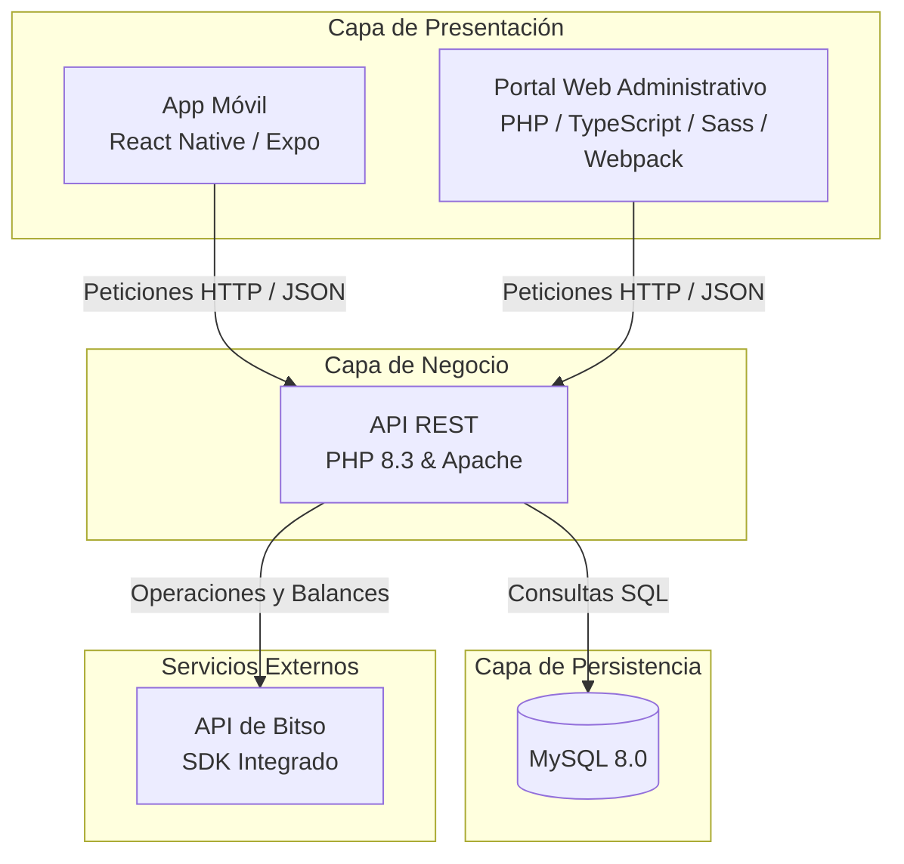

# 🪙 CryptoWallet

[](https://www.php.net/)
[](https://reactnative.dev/)
[](https://expo.dev/)
[](https://www.docker.com/)
[](https://www.mysql.com/)

**CryptoWallet** es un ecosistema integral y autohospedado para la gestión de carteras de criptomonedas. Está diseñado con una arquitectura robusta de tres capas: una **API REST de alto rendimiento en PHP 8.3**, una **aplicación de administración/portal web** interactiva y una **aplicación móvil multiplataforma** construida con React Native y Expo.

La integración nativa con el **SDK de Bitso** permite a los usuarios que configuren sus API keys consultar saldos reales de manera segura, auditar transacciones en tiempo real y ejecutar operaciones u órdenes de compra/venta directamente desde la plataforma.

> ⚠️ **AVISO DE SEGURIDAD PARA DESARROLLO:** Este repositorio está estructurado para entornos de desarrollo locales. Nunca confirmes credenciales reales, tokens ni claves API de Bitso en sistemas de control de versiones públicos.

---

## 🏗️ Arquitectura del Sistema

El ecosistema está modularizado para separar las responsabilidades de presentación, lógica de negocio y persistencia de datos:



---

## 📁 Componentes del Proyecto

| Directorio | Tecnología Principal | Descripción |
| :--- | :--- | :--- |
| [`api/`](./api) | PHP 8.3 | API REST principal. Contiene controladores de endpoints, helpers de integración y persistencia con modelos autogenerados de base de datos. |
| [`web/`](./web) | PHP + Webpack/TS | Portal web administrativo autohospedado que consume la API. Incluye módulos para clientes, estadísticas, notificaciones y operaciones de cartera. |
| [`app/`](./app) | React Native (Expo) | Aplicación móvil nativa compilada con TypeScript. Interfaz moderna y fluida para el seguimiento diario de tus criptoactivos. |
| `api/Lib/` | PHP (Submódulo) | Core y utilidades compartidas de la API REST (se maneja como submódulo Git). |
| `web/core/` | PHP (Submódulo) | Core y utilidades compartidas del Portal Web (se maneja como submódulo Git). |

---

## 🗄️ Modelo de Base de Datos

La base de datos MySQL (esquema `cryptowallet`) se genera y asocia dinámicamente mediante los modelos ORM de la API. A continuación, se detalla la estructura del esquema físico de tablas, sus columnas y relaciones:

### 1. Tabla `usuarios`
Gestiona los perfiles de los usuarios y su jerarquía de clientes.
*   **Características:** Soporta relaciones recursivas para vincular perfiles administradores y clientes.

| Campo | Tipo | Nulo | Por Defecto | Descripción |
| :--- | :--- | :--- | :--- | :--- |
| `id_usuario` | `BIGINT(20)` | No | *Auto-incremental* | Clave primaria del usuario. |
| `id_cliente` | `BIGINT(20)` | Sí | `NULL` | ID del administrador asociado (FK a `usuarios.id_usuario`). |
| `perfil_usuario` | `INT(11)` | Sí | `1` | Rol o perfil de acceso (ej. `1` para usuario estándar). |
| `nombre_usuario` | `VARCHAR(100)` | No | | Nombre completo del usuario. |
| `correo_usuario` | `VARCHAR(100)` | No | | Correo electrónico único (usado para login). |
| `password_usuario` | `VARCHAR(255)` | No | | Hash seguro de la contraseña. |
| `last_login_usuario` | `DATETIME` | Sí | `NULL` | Registro de la última fecha y hora de inicio de sesión. |

*   **Índices y Restricciones:**
    *   `PRIMARY KEY (id_usuario)`
    *   `UNIQUE INDEX usuarios_correo_usuario_uindex (correo_usuario)`
    *   `FOREIGN KEY (id_cliente) REFERENCES usuarios (id_usuario) ON UPDATE CASCADE ON DELETE SET NULL`

---

### 2. Tabla `monedas`
Catálogo maestro de divisas y criptoactivos soportados por el sistema.

| Campo | Tipo | Nulo | Por Defecto | Descripción |
| :--- | :--- | :--- | :--- | :--- |
| `id_moneda` | `VARCHAR(5)` | No | | Código identificador único (ej: `'btc'`, `'eth'`, `'mxn'`). |
| `par_moneda` | `VARCHAR(5)` | No | | Par fiduciario de cotización (típicamente `'mxn'`). |
| `nombre_moneda` | `VARCHAR(100)` | No | | Nombre legible completo del activo. |

*   **Índices y Restricciones:**
    *   `PRIMARY KEY (id_moneda)`
    *   `UNIQUE INDEX monedas_nombre_moneda_uindex (nombre_moneda)`

---

### 3. Tabla `usuarios_transacciones`
Historial de operaciones financieras y compras/ventas de criptoactivos por usuario.
*   **Características:** Permite calcular el precio promedio ponderado de compra (DCA) y valor acumulado.

| Campo | Tipo | Nulo | Por Defecto | Descripción |
| :--- | :--- | :--- | :--- | :--- |
| `id_usuario_transaccion` | `BIGINT(20)` | No | *Auto-incremental* | Clave primaria única. |
| `id_usuario` | `BIGINT(20)` | No | | Identificador del usuario que opera (FK). |
| `id_moneda` | `VARCHAR(5)` | No | | Identificador del criptoactivo de la transacción (FK). |
| `oid` | `VARCHAR(100)` | Sí | `NULL` | ID de la orden provisto por la API de Bitso (si aplica). |
| `costo_usuario_moneda` | `DECIMAL(15,2)` | Sí | `0.00` | Costo neto en divisa fiduciaria (valores negativos representan ventas o egresos). |
| `cantidad_usuario_moneda` | `DECIMAL(15,8)` | No | | Cantidad neta del activo adquirido o vendido (negativo para ventas). |
| `precio_original_usuario_moneda` | `DECIMAL(15,2)` | Sí | `NULL` | Precio de cotización unitario original de la orden en Bitso. |
| `precio_real_usuario_moneda` | `DECIMAL(15,2)` | Sí | `NULL` | Precio unitario real final de ejecución. |
| `fecha_usuario_transaccion` | `TIMESTAMP` | No | `CURRENT_TIMESTAMP` | Sello temporal de la transacción. |

*   **Índices y Restricciones:**
    *   `PRIMARY KEY (id_usuario_transaccion)`
    *   `FOREIGN KEY (id_usuario) REFERENCES usuarios (id_usuario) ON UPDATE CASCADE ON DELETE CASCADE`
    *   `FOREIGN KEY (id_moneda) REFERENCES monedas (id_moneda) ON UPDATE CASCADE ON DELETE CASCADE`

---

### 4. Tabla `usuarios_keys`
Almacenamiento de las llaves de acceso públicas y secretas para interactuar de forma autenticada con la API de Bitso.
*   **🔐 Mecanismo de Seguridad y Cifrado:** Por estrictas directivas de seguridad de la plataforma, tanto `api_key` como `api_secret` **se almacenan cifrados** de forma segura en la base de datos.
    *   **Algoritmo de Cifrado:** Se emplea cifrado simétrico **AES-256-CBC** a través de la función `System::encrypt($value)`. Este método concatena un identificador dinámico (`uniqid()`) con el valor de la clave, y utiliza la semilla global `CONFIG['seed']` para realizar el cifrado y generar un vector de inicialización (IV) seguro.
    *   **Descifrado al Vuelo (On-the-fly):** Al instanciar el helper de conexión con el exchange (`Helper\Bitso::__construct($user_id)`), las llaves se descifran en memoria en tiempo de ejecución utilizando la función `System::decrypt($value_encrypted)` con la misma semilla, asegurando que las credenciales nunca queden expuestas en texto plano ni en la base de datos ni en logs.

| Campo | Tipo | Nulo | Por Defecto | Descripción |
| :--- | :--- | :--- | :--- | :--- |
| `id_usuario` | `BIGINT(20)` | No | | Identificador del usuario propietario de las llaves (FK). |
| `api_key` | `VARCHAR(255)` | No | | API Key pública cifrada con AES-256-CBC para conexión con Bitso. |
| `api_secret` | `VARCHAR(255)` | No | | API Secret privada y cifrada con AES-256-CBC para firmar peticiones. |

*   **Índices y Restricciones:**
    *   `PRIMARY KEY (id_usuario)`
    *   `FOREIGN KEY (id_usuario) REFERENCES usuarios (id_usuario) ON UPDATE CASCADE ON DELETE CASCADE`

---

### 5. Tabla `usuarios_monedas_limites`
Definición de umbrales máximos o mínimos de cambio de valor para alertas automatizadas.

| Campo | Tipo | Nulo | Por Defecto | Descripción |
| :--- | :--- | :--- | :--- | :--- |
| `id_usuario_moneda_limite` | `BIGINT(20)` | No | *Auto-incremental* | Clave primaria única. |
| `id_usuario` | `BIGINT(20)` | No | | Identificador del usuario (FK). |
| `id_moneda` | `VARCHAR(5)` | No | | Identificador de la moneda a supervisar (FK). |
| `limite` | `DECIMAL(15,2)` | No | | Umbral porcentual de fluctuación establecido por el usuario. |
| `cantidad` | `DECIMAL(15,2)` | Sí | `NULL` | Margen delta de variación calculado para activar la alerta. |

*   **Índices y Restricciones:**
    *   `PRIMARY KEY (id_usuario_moneda_limite)`
    *   `UNIQUE INDEX usuarios_monedas_limites_id_usuario_id_moneda_uindex (id_usuario, id_moneda)`
    *   `FOREIGN KEY (id_usuario) REFERENCES usuarios (id_usuario) ON UPDATE CASCADE ON DELETE CASCADE`
    *   `FOREIGN KEY (id_moneda) REFERENCES monedas (id_moneda) ON UPDATE CASCADE ON DELETE CASCADE`

---

### 6. Tabla `usuarios_notificaciones`
Bitácora e historial de las alertas disparadas relativas a fluctuaciones o errores del sistema.

| Campo | Tipo | Nulo | Por Defecto | Descripción |
| :--- | :--- | :--- | :--- | :--- |
| `id_usuario_notificacion` | `BIGINT(20)` | No | *Auto-incremental* | Clave primaria única. |
| `id_usuario` | `BIGINT(20)` | No | | Identificador del usuario notificado (FK). |
| `type` | `VARCHAR(15)` | No | | Tipo de notificación (ej: `'error'`, `'activity_up'`, `'activity_down'`). |
| `message` | `VARCHAR(100)` | No | | Contenido de texto del mensaje de alerta. |
| `data` | `JSON` | Sí | `NULL` | Metadatos estructurados de soporte (ej. `{"coin": "btc"}`). |
| `timestamp` | `TIMESTAMP` | No | `CURRENT_TIMESTAMP` | Sello de fecha y hora en la que se generó la alerta. |

*   **Índices y Restricciones:**
    *   `PRIMARY KEY (id_usuario_notificacion)`
    *   `FOREIGN KEY (id_usuario) REFERENCES usuarios (id_usuario) ON UPDATE CASCADE ON DELETE CASCADE`

---

### 7. Tabla `precios_monedas`
Historial de precios de mercado recuperados de Bitso para cálculos de valuación histórica y alertas.

| Campo | Tipo | Nulo | Por Defecto | Descripción |
| :--- | :--- | :--- | :--- | :--- |
| `id_moneda` | `VARCHAR(5)` | No | | Código de la divisa (FK a `monedas.id_moneda`). |
| `precio_moneda` | `DECIMAL(15,2)` | No | | Cotización de mercado al momento del registro. |
| `fecha_precio_moneda` | `TIMESTAMP` | No | `CURRENT_TIMESTAMP` | Momento de la toma de precio. |

*   **Índices y Restricciones:**
    *   `FOREIGN KEY (id_moneda) REFERENCES monedas (id_moneda) ON UPDATE CASCADE ON DELETE CASCADE`

---

## 🛠️ Requisitos Previos

Antes de comenzar, asegúrate de tener instalados los siguientes componentes:

*   **Docker Desktop** (con soporte para Docker Compose).
*   **Git 2.x** (para control de versiones e inicialización de submódulos).
*   **Node.js v16+** (compatible con Expo SDK 47) y **Yarn** (o npm) para compilar recursos frontend y ejecutar la app móvil.

---

## 🚀 Guía de Instalación Paso a Paso

Sigue estos pasos detallados para poner en marcha todo el entorno local de desarrollo:

### 1. Clonar el repositorio e inicializar submódulos
El proyecto utiliza submódulos de Git para mantener sincronizado el core del sistema. Ejecuta:

```bash
git clone https://github.com/gcachuo/CryptoWallet.git
cd CryptoWallet
git submodule update --init --recursive
```

*Nota: Si ya tenías clonado el repositorio, recuerda ejecutar el comando `git submodule update --init --recursive` para descargar el contenido de los submódulos.*

---

### 2. Configurar la API y Base de Datos local
Crea el archivo de configuración de base de datos de la API. Esta configuración local está excluida de Git por seguridad. 

Crea el archivo **`api/Config/database.json`** con el siguiente contenido:

```json
{
  "host": "db",
  "username": "root",
  "passwd": "sqlserver",
  "dbname": "cryptowallet"
}
```

*Nota: El host `db` apunta directamente al contenedor MySQL dentro de la red interna de Docker Compose. Si decides levantar la API fuera de Docker, cambia este host y puerto de acuerdo con tu configuración local.*

---

### 3. Levantar los contenedores de Docker
Inicia los servicios de Apache/PHP y MySQL en segundo plano:

```bash
docker compose up -d --build
```

Una vez completado el despliegue, los servicios locales estarán mapeados a los siguientes puertos:

| Servicio | Dirección Local |
| :--- | :--- |
| **Portal Web (Apache)** | [http://localhost/](http://localhost/) |
| **API REST (Apache)** | [http://localhost/api/](http://localhost/api/) |
| **MySQL Database** | `localhost:3306` (Usuario: `root` / Pass: `sqlserver`) |

Para auditar el estado de los contenedores o revisar los registros del servidor:
```bash
docker compose ps
docker compose logs -f web
```

---

### 4. Instalar las dependencias de PHP (Composer)
Ejecuta la instalación de dependencias requeridas por la API dentro del contenedor en ejecución:

```bash
docker compose exec web php /var/www/html/composer.phar install --working-dir=/var/www/html/api
```

Esto descargará e instalará el SDK oficial de Bitso y otros componentes lógicos internos de la API.

---

### 5. Compilar recursos del Portal Web
El portal web administrativo utiliza Webpack para empaquetar archivos TypeScript, Sass y librerías CSS/JS.

Accede al directorio de recursos frontend, instala las dependencias de Node e inicia la compilación:

```bash
cd web/assets/src
yarn install
# Para compilar en modo desarrollo y habilitar watch automático de cambios:
yarn webpack:watch
```

Si prefieres realizar una compilación única para producción, puedes usar:
```bash
yarn webpack:build:prod
```

Asegúrate de comprobar que el archivo `web/settings.json` apunte a la URL correcta de tu API local o de desarrollo:
```json
{
  "apiUrl": "http://localhost/api/"
}
```

---

### 6. Configurar e inicializar la Aplicación Móvil
En una nueva pestaña de la terminal, accede al directorio `app` para configurar e iniciar la app móvil.

#### A. Configurar la URL de la API
Edita el archivo [`app/app.json`](app/app.json) en la sección `expo.extra` para definir a qué API se conectará la aplicación:

```json
{
  "expo": {
    ...
    "extra": {
      "ENV": "LOCAL",
      "BASE_URL": {
        "LOCAL": "http://<IP_DE_TU_EQUIPO>/api/",
        "DEV": "https://cryptowallet.gcachuo.com/api/"
      }
    }
  }
}
```

> 💡 **Consejo clave:** Sustituye `<IP_DE_TU_EQUIPO>` por la dirección IP privada de tu ordenador (por ejemplo, `192.168.1.50`). Los dispositivos móviles reales y emuladores externos no interpretan `localhost` o `127.0.0.1` as tu máquina de desarrollo, sino como ellos mismos.

#### B. Instalar dependencias e iniciar Expo
Instala las dependencias y arranca el servidor de desarrollo de Expo CLI:

```bash
cd app
yarn install
yarn start
```

*Alternativamente, puedes usar npm:*
```bash
npm install
npm start
```

Desde la interfaz de desarrollo de Expo, presiona:
*   `a` para abrir en un emulador o dispositivo **Android**.
*   `i` para abrir en un simulador o dispositivo **iOS** (disponible en macOS).
*   `w` para ejecutarlo en un navegador **web**.

También puedes descargar la app **Expo Go** en tu smartphone físico y escanear el código QR que se muestra en la terminal para probar la aplicación directamente en hardware real.

---

## ✨ Funcionalidades Destacadas

*   **Autenticación Segura:** Flujos robustos de registro, login y gestión de tokens de sesión (`useAccessToken`).
*   **Gestor de Cartera Activo:** Consulta detallada de saldos, portafolio de criptoactivos y variaciones de valor en tiempo real.
*   **Historial de Transacciones Inteligente:** Registro manual o automático de movimientos con cálculos automáticos del costo promedio de compra de cada activo.
*   **Límites y Alertas:** Parámetros configurables de límites de compra/venta por moneda con alertas automatizadas.
*   **Integración Bitso SDK:** Sincronización directa con el balance real de Bitso, lectura de órdenes activas y ejecución ágil de trades.
*   **Notificaciones Personalizadas:** Panel interactivo para monitorizar alertas de fluctuación de precios y estado del sistema.

---

## 🛠️ Desarrollo, Pruebas y Depuración

### Depuración con Xdebug
El contenedor Docker de PHP viene preconfigurado con soporte para **Xdebug** activado en modo depuración (`xdebug.mode=debug`). El host receptor de conexiones se mapea automáticamente a `host.docker.internal`.
Configura tu entorno de desarrollo (PhpStorm, VS Code, etc.) para escuchar conexiones en el puerto `9003` para iniciar sesiones de depuración paso a paso en tiempo real.

### Pruebas E2E (Cypress)
El módulo web administrativo incluye configuraciones para pruebas de integración de extremo a extremo (E2E) con **Cypress**.

Para abrir la interfaz de ejecución interactiva de Cypress:
```bash
cd web/assets/src
yarn cypress:open:dev
```

Para correr las pruebas directamente desde la terminal en modo headless:
```bash
yarn cypress:run:dev
```

### Gestión de Base de Datos
Si necesitas resetear por completo tu base de datos de desarrollo (incluyendo los volúmenes de Docker donde MySQL almacena los datos físicos):

```bash
# Apaga los servicios y remueve volúmenes
docker compose down -v
# Vuelve a encender recreando la BD vacía
docker compose up -d
```

---

## 🔒 Buenas Prácticas de Seguridad

1.  **Manejo de Secretos:** Nunca desactives las restricciones del archivo `.gitignore`. No commitees secretos de bases de datos o llaves API de Bitso.
2.  **Tokens e Interceptores:** En la app móvil, el consumo de endpoints está interceptado de forma segura usando Axios Interceptors (`useAxiosInterceptors.tsx`), asegurando que las cabeceras de autorización se limpien correctamente al cerrar sesión.
3.  **Entornos de Producción:** Para despliegues productivos, asegúrate de utilizar certificados SSL/TLS (HTTPS) obligatorios, deshabilitar Xdebug en el contenedor de Apache y cambiar la clave raíz de MySQL en el archivo `docker-compose.yml`.

---

## 👥 Contribución y Buenas Prácticas

Si deseas colaborar con mejoras o nuevas integraciones en CryptoWallet, sigue este flujo de desarrollo estándar:

1.  Crea una rama de características a partir de la rama principal: `git checkout -b feature/nueva-mejora`.
2.  Desarrolla tus cambios respetando los estándares de formato (TypeScript, Sass, PHP PSR).
3.  Prueba las modificaciones localmente (móvil, web y endpoints de la API).
4.  Realiza commits limpios y explicativos.
5.  Abre un Pull Request detallando las pruebas realizadas y los módulos afectados.

---

## 📄 Licencia

Este proyecto está bajo licencia de uso privado y exclusivo de desarrollo. Todos los derechos reservados.
